
<h1 align="center">分布式架构网上商城</h1>

## 简介
分布式架构网上商城：角色分为管理员、用户；提供用户注册、商品浏览、订单管理、个人信息管理等功能；采用微服务架构，包含用户、商品、订单和支付服务模块，支持多种支付方式和高效的内容管理。    --计算机毕业设计源码；毕设源码；java毕业设计源码

## 联系方式

<h3 align="center">获取完整代码与数据库文件 + 微信：deepguan QQ: 86050149 QQ群: 783742310</h3>

<h3 align="center">可帮忙远程部署 包运行成功！提供远程部署、修改代码、设计文档指导、代码讲解等服务！</h3>

## 功能介绍（完整见运行截图）
管理员： 管理员可以通过管理界面对商城进行全面操控，包括用户管理、商品信息管理、商品分类管理、系统管理、轮播图管理和订单管理。管理员能够上传和设置轮播图的名称，查看并调整订单的详细信息如订单编号、支付类型和状态等。权限还包括新增、删除和编辑商品，通过商品管理模块，管理员可以更新商品的规格、库存、价格及上架时间，管理商品分类，确保商品信息的准确和及时更新。

用户： 用户通过注册界面创建账户，填写账号、密码、姓名、手机号和邮箱来完成注册。在个人中心，用户可以管理个人信息，包括编辑账户名、性别、密码、电话和邮箱。用户能够查看及管理订单状态，从未支付到已完成等多种状态标签，并可进行退款申请。通过地址管理界面，用户可以添加和设为默认地址，方便商品配送。在商品界面，用户可以浏览商品类别、搜索商品、查看详情，并将商品加入购物车或收藏夹，提升购物体验。

## 运行截图
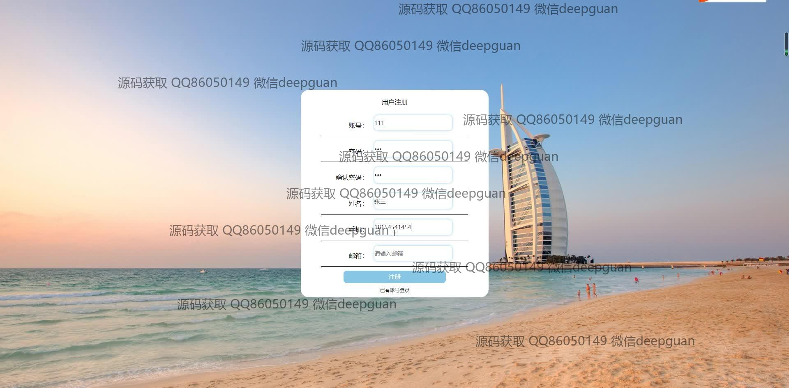

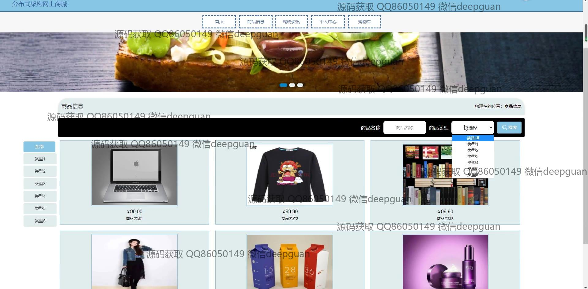
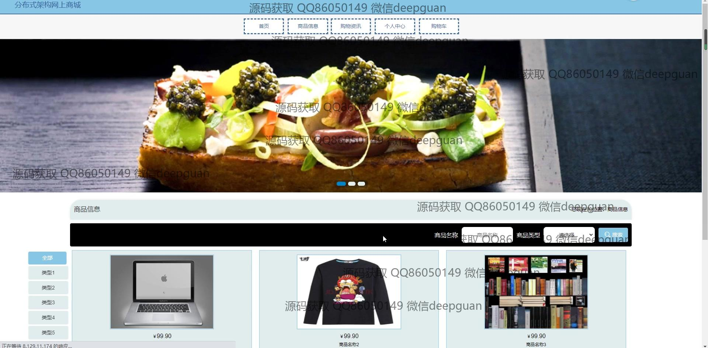
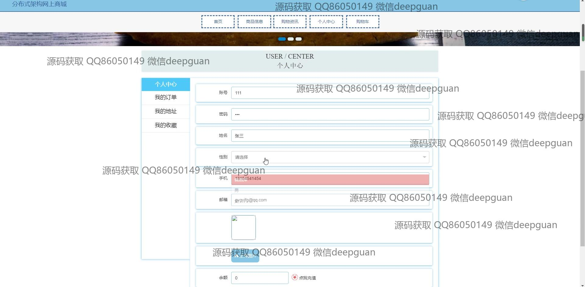
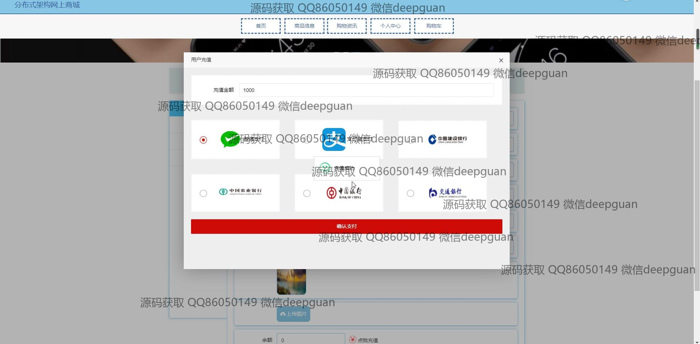
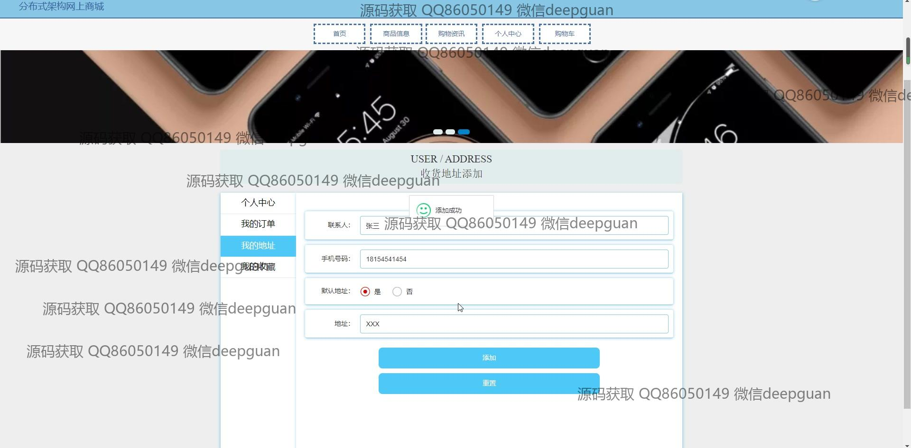
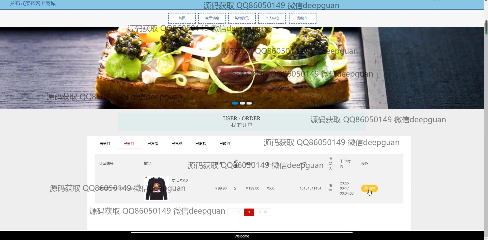
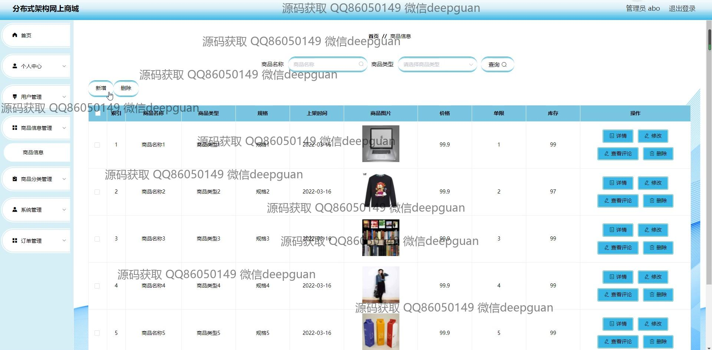
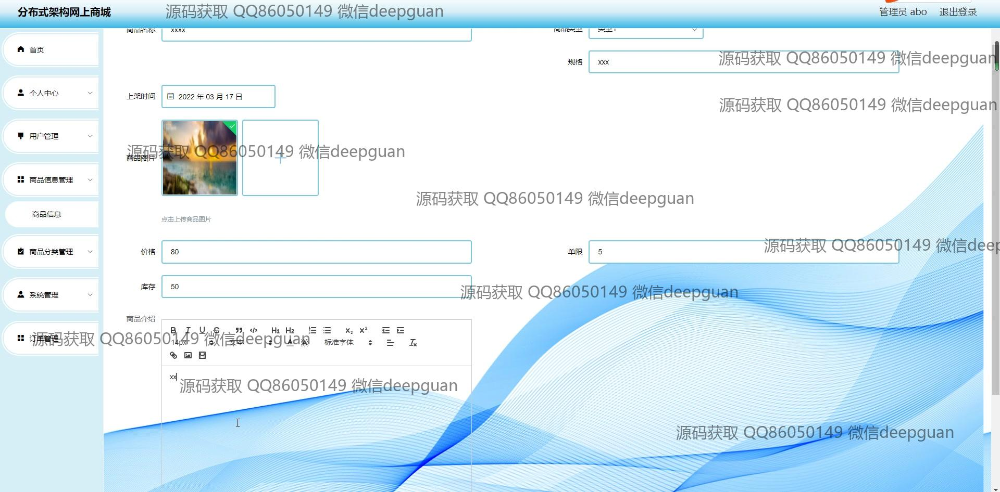
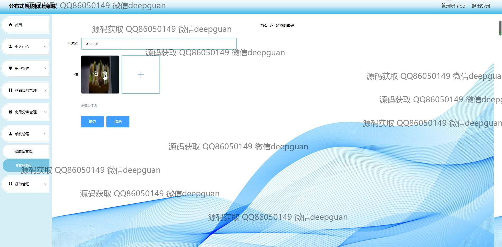
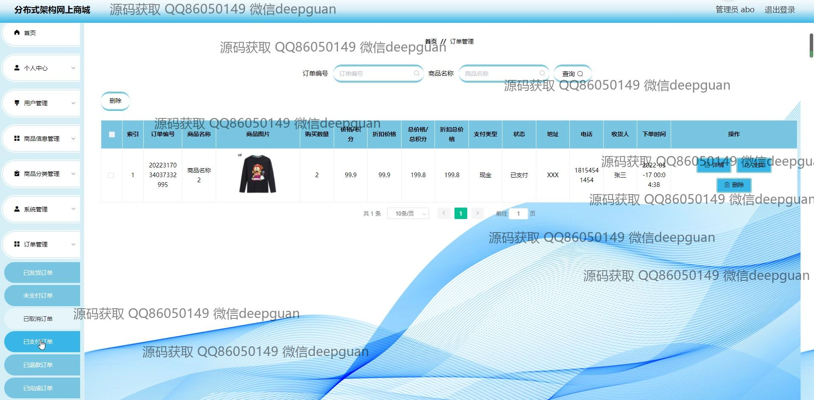
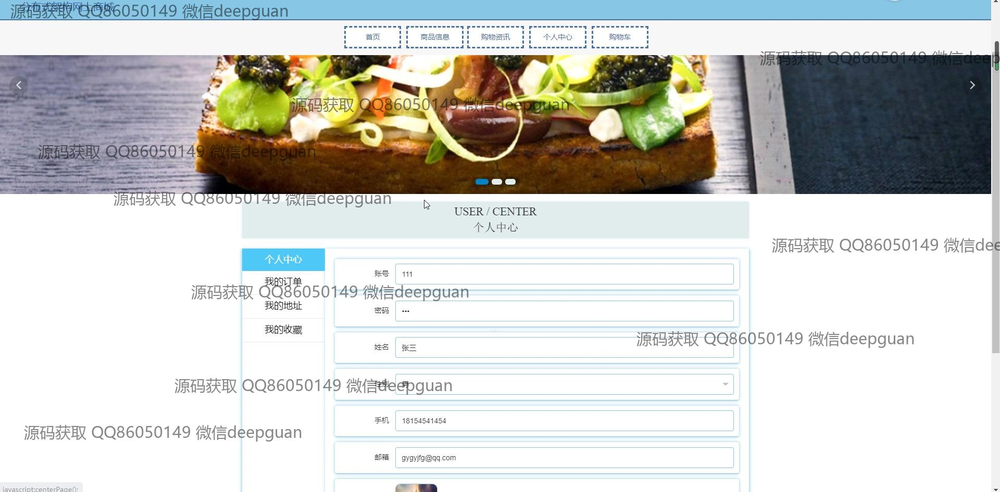
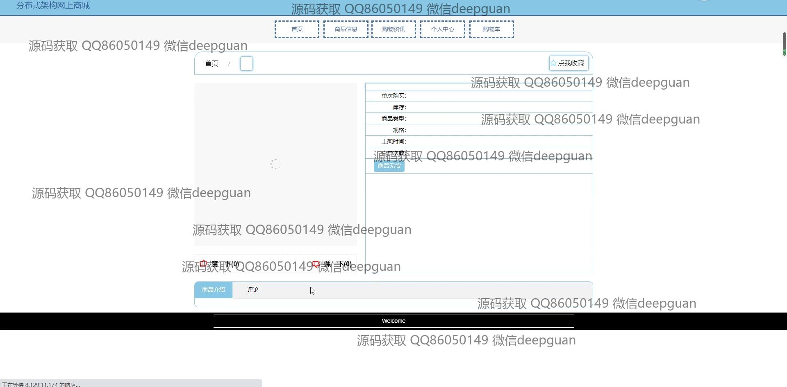
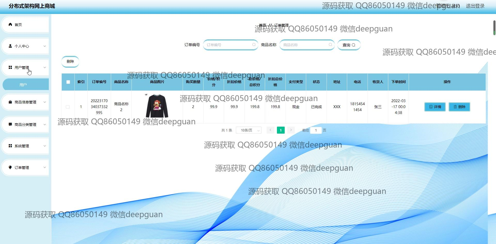

本代码来源于网络,仅供学习参考使用!

